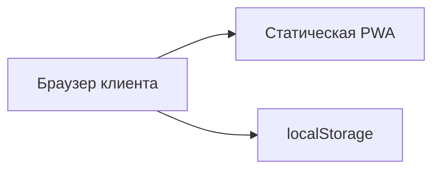
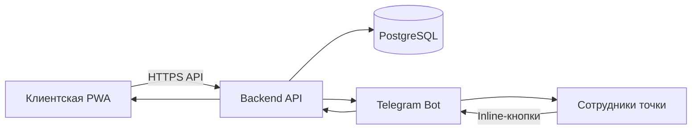

# Шаверма БН

PWA для анонимного предзаказа еды на самовывоз.

Клиент сканирует QR-код, выбирает позиции и время получения, оформляет заказ без регистрации и получает короткий номер. Сотрудники точки принимают и обрабатывают заказы через Telegram.

```text
QR → меню → корзина → время → номер заказа → получение
```

## Зачем нужен проект

Сейчас рабочий сценарий точки выглядит так: клиент звонит, просит приготовить заказ к определённому времени, затем приходит, оплачивает и забирает его.

«Шаверма БН» заменяет телефонный звонок простой веб-витриной:

- не нужно устанавливать приложение;
- не нужно создавать аккаунт;
- не нужно вводить имя или телефон;
- клиент сразу видит меню, цены и доступное время;
- точка получает структурированный заказ вместо устного разговора.

## Текущий статус

Работает клиентский PWA-прототип:

- актуальное меню;
- категории;
- карточки товаров;
- допы;
- корзина;
- изменение количества;
- выбор времени;
- экран номера заказа;
- сохранение корзины и последнего заказа в браузере;
- установка на главный экран как PWA;
- офлайн-кэш статических файлов.

На текущем этапе заказ существует только в браузере клиента:

- номер генерируется локально;
- заказ не отправляется сотрудникам;
- меню и наличие находятся в `app.js`;
- статус не синхронизируется с точкой.

Следующий этап — backend, PostgreSQL и Telegram-бот.

---

## MVP

Первая рабочая версия строится без:

- имени;
- телефона;
- email;
- регистрации;
- аккаунта;
- бонусов;
- CRM-профиля;
- доставки;
- онлайн-оплаты.

Мы храним заказ, а не человека.

### Клиентский сценарий

1. Клиент сканирует QR-код.
2. Открывает меню.
3. Добавляет товары и допы.
4. Выбирает доступное время.
5. Нажимает «Оформить заказ».
6. Получает экран:

```text
Ваш заказ №137
Получение в 18:30
Покажите или назовите номер на точке.
```

Доступные статусы:

```text
Заказ принят
Заказ обработан — можно забирать
```

Клиент приходит, называет номер и получает заказ.

SMS, идентификация и аккаунт не нужны.

### Как заказ восстанавливается

У каждого заказа будет три идентификатора:

- внутренний UUID;
- короткий номер для выдачи;
- случайный публичный токен.

Пример публичной ссылки:

```text
/order/8K4F2M
```

Клиенту показывается только:

```text
Заказ №137
```

Ссылка сохраняется в браузере, поэтому заказ можно открыть повторно без аккаунта.

Короткий номер нельзя использовать как единственный ключ доступа: последовательные номера легко перебираются.

---

## Telegram-флоу

Telegram используется как операционный интерфейс точки. Отдельной веб-админки в MVP нет.

В закрытую группу приходит карточка:

```text
Новый заказ №137
Получение: 18:30

2 × Классика в лаваше
  + халапеньо
  + грибы

1 × Картофель фри

Итого: 790 ₽
Оплата при получении
```

Сначала доступны кнопки:

```text
[Принять] [Отменить]
```

После принятия исходная карточка редактируется:

```text
✅ Заказ №137 принят
```

И появляется кнопка:

```text
[Обработан]
```

После обработки:

```text
🟢 Заказ №137 обработан
```

Клиентская страница получает обновлённый статус.

Статуса «Выдан» в MVP нет: после фактической выдачи процесс заканчивается естественно.

### Аварийная отмена

Кнопка «Отменить» нужна, если:

- заказ продублировался;
- сотрудник не успевает;
- товар фактически закончился;
- создан тестовый или ошибочный заказ;
- объём невозможно приготовить к выбранному времени.

Клиент увидит:

```text
Заказ не удалось подтвердить.
Пожалуйста, оформите новый заказ или обратитесь на точку.
```

---

## Управление наличием

Главное меню Telegram-бота:

```text
[Заказы] [Наличие] [Настройки точки]
```

У позиции четыре состояния:

- **В наличии** — товар можно добавить в заказ.
- **Стоп** — товар виден, но добавление заблокировано.
- **Будет позже** — товар виден с указанием времени.
- **Скрыта** — товар не отображается в меню.

Быстрые действия:

```text
[В наличии] [Стоп] [Будет позже]
[Через 30 минут] [Через час] [Указать время]
```

Глобальное управление:

```text
[Приостановить заказы]
[Возобновить заказы]
```

При паузе меню остаётся доступным, но оформление блокируется.

---

## Временные слоты

Начальная модель нагрузки:

- слот каждые 15 минут;
- минимальное время приготовления;
- фиксированный лимит заказов на слот;
- заполненные слоты автоматически скрываются;
- прошедшие и слишком близкие слоты не показываются.

Например, в 18:02 клиент может увидеть:

```text
18:30 · 18:45 · 19:00 · 19:15
```

Через Telegram владелец сможет менять:

- минимальное время приготовления;
- лимит заказов на слот;
- расписание точки;
- доступность предзаказа сегодня.

Расчёт нагрузки по сложности каждой позиции в MVP не нужен.

---

## Архитектура

### Текущая



### Целевая для MVP



### Ответственность компонентов

#### PWA

- показывает меню;
- управляет локальной корзиной;
- показывает доступные слоты;
- отправляет заказ;
- показывает номер и статус;
- сохраняет ссылку на последний заказ.

#### Backend

- является источником истины;
- рассчитывает сумму;
- проверяет цены, наличие и слот;
- создаёт уникальный номер;
- хранит заказ;
- отправляет Telegram-уведомления;
- обрабатывает смену статуса;
- защищает от повторного оформления.

#### PostgreSQL

Хранит:

- категории;
- товары;
- допы;
- доступность;
- настройки точки;
- заказы;
- позиции заказов;
- события и статусы.

#### Telegram-бот

- отправляет новые заказы;
- принимает команды сотрудников;
- управляет стоп-листом;
- включает и выключает предзаказы;
- меняет базовые настройки слотов.

---

## Какие данные хранятся

Только операционные:

- UUID заказа;
- короткий номер;
- публичный токен;
- состав;
- стоимость;
- время получения;
- статус;
- время создания;
- время обновления.

Не хранятся:

- имя;
- телефон;
- email;
- адрес;
- аккаунт;
- история конкретного клиента;
- рекламные идентификаторы;
- сторонняя поведенческая аналитика.

Технические access-логи должны быть отключены, анонимизированы или храниться ограниченное время.

---

## Защита от ошибок

Backend должен корректно обрабатывать:

- двойное нажатие «Оформить»;
- повторный Telegram callback;
- потерю соединения;
- изменение наличия во время оформления;
- заполнение слота между открытием корзины и подтверждением;
- временную недоступность Telegram.

Критичные операции должны быть идемпотентными.

Frontend не считается доверенным источником цены, наличия или статуса.

---

## Технологии

### Сейчас

- HTML;
- CSS;
- JavaScript;
- PWA manifest;
- Service Worker;
- localStorage.

### Следующий этап

- Backend: FastAPI или Node.js;
- PostgreSQL;
- Telegram Bot API;
- Docker Compose;
- Nginx или Caddy;
- небольшой VDS;
- HTTPS;
- резервное копирование базы.

Переход frontend на React или другой фреймворк не нужен, пока текущий интерфейс остаётся управляемым.

---

## Структура проекта

```text
.
├── index.html
├── styles.css
├── app.js
├── manifest.webmanifest
├── service-worker.js
├── icons/
├── docs/
│   ├── README.md
│   ├── MVP.md
│   ├── ARCHITECTURE.md
│   ├── PRINCIPLES.md
│   ├── ORDER_FLOW.md
│   ├── ROADMAP.md
│   └── DECISIONS.md
└── README.md
```

Подробная документация находится в [`docs/`](./docs/README.md).

---

## Локальный запуск

Service Worker требует HTTP-контекст.

```bash
python -m http.server 8080
```

После запуска:

```text
http://localhost:8080
```

---

## Roadmap

### 0. Клиентская PWA — выполнено

Меню, корзина, допы, время, номер заказа и локальное сохранение.

### 1. Backend и реальные заказы

- API;
- PostgreSQL;
- единая нумерация;
- публичные токены;
- серверная проверка цены, наличия и слота;
- страница статуса.

### 2. Telegram-операционка

- новый заказ;
- «Принять»;
- «Обработан»;
- аварийная отмена;
- синхронизация с клиентом;
- журнал действий.

### 3. Наличие и настройки точки

- стоп-лист;
- «будет позже»;
- скрытие товара;
- пауза заказов;
- расписание;
- лимиты слотов.

### 4. Реальный пилот

1–2 недели работы с оплатой при получении.

Проверяем:

- пользуются ли люди QR;
- сколько корзин превращается в заказ;
- понятен ли номер;
- достаточно ли двух статусов;
- удобен ли Telegram;
- подходят ли лимиты слотов;
- сколько заказов не забирают.

### 5. Исследование кассы и оплаты

- модель кассы;
- кассовое ПО;
- ОФД;
- продукты Сбера;
- API СБП;
- callback;
- чеки;
- полный и частичный возврат.

### 6. СБП и фискализация

Подключаются только после проверки основного процесса.

---

## Не входит в текущий MVP

- СБП;
- касса;
- чеки;
- возвраты;
- регистрация;
- персональные данные;
- программа лояльности;
- доставка;
- полноценная веб-админка;
- сложный складской учёт;
- сеть филиалов;
- SaaS-платформа.
