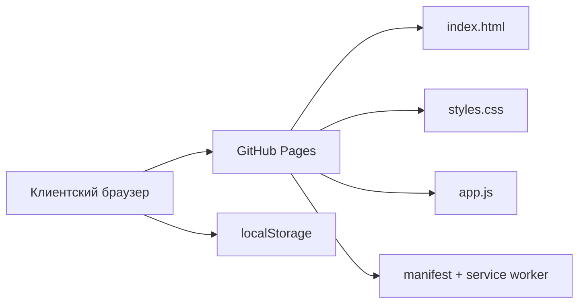
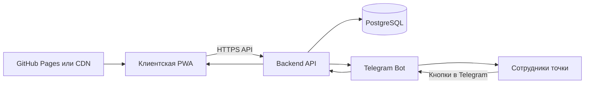
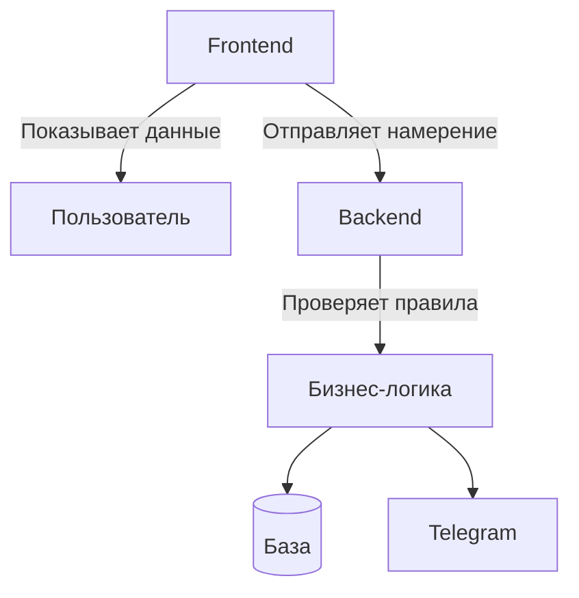
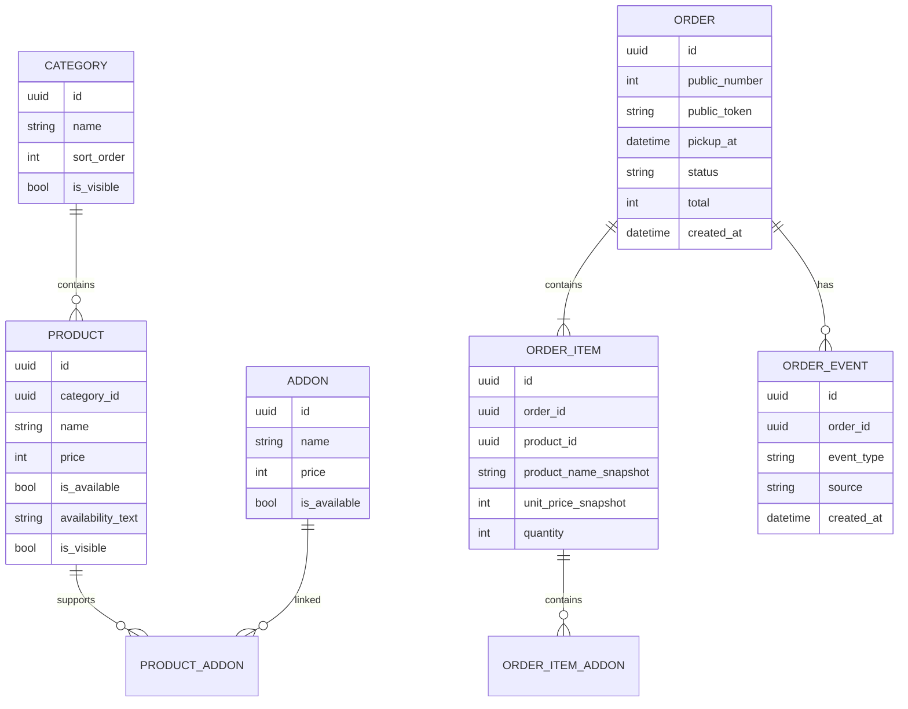

# Архитектура проекта

## 1. Назначение системы

«Шаверма БН» — сервис анонимного предзаказа еды на самовывоз.

Клиент:

1. открывает PWA по QR-коду или ссылке;
2. выбирает блюда и допы;
3. выбирает время получения;
4. оформляет заказ без имени, телефона и регистрации;
5. получает короткий номер заказа;
6. приходит на точку и называет номер.

Сотрудники точки получают заказ в Telegram и меняют его состояние кнопками.

---

## 2. Текущая архитектура

Сейчас проект является полностью статической PWA.



### Что уже работает

- адаптивный интерфейс;
- каталог и категории;
- допы;
- корзина;
- выбор времени;
- локальная генерация номера заказа;
- сохранение корзины и последнего заказа в `localStorage`;
- установка приложения как PWA;
- офлайн-кэш статических файлов.

### Ограничения текущей версии

- у разных клиентов нет общей нумерации;
- заказ не отправляется сотрудникам;
- наличие товаров зашито в коде;
- лимиты временных слотов не проверяются централизованно;
- статусы не синхронизируются;
- локальный номер заказа не имеет операционной ценности;
- данные исчезнут при очистке браузера.

---

## 3. Целевая архитектура MVP

После подключения серверной части система должна состоять из четырёх основных компонентов:



### Компоненты

#### 3.1. Клиентская PWA

Отвечает только за клиентский интерфейс:

- загрузку актуального меню;
- выбор товаров и допов;
- корзину;
- получение доступных временных слотов;
- создание заказа;
- отображение номера и статуса;
- сохранение ссылки на последний заказ в браузере.

PWA не должна содержать секреты, токены Telegram или доступ к базе данных.

#### 3.2. Backend API

Backend является центральным источником истины.

Он отвечает за:

- меню и наличие;
- временные слоты;
- создание заказов;
- уникальную нумерацию;
- проверку состава и цены заказа;
- смену статусов;
- Telegram-уведомления;
- защиту от повторных запросов;
- автоматическое закрытие устаревших заказов;
- дальнейшую интеграцию с оплатой и кассой.

#### 3.3. PostgreSQL

В базе хранятся операционные данные:

- товары;
- категории;
- допы;
- доступность позиций;
- настройки точки;
- временные слоты;
- заказы;
- позиции заказов;
- изменения статусов;
- технические идентификаторы Telegram-сообщений.

Персональные данные клиента не хранятся.

#### 3.4. Telegram-бот

Telegram используется как лёгкая операционная панель для сотрудников.

Бот должен уметь:

- присылать новый заказ в закрытую группу;
- показывать состав, сумму, время и номер;
- менять статус кнопками;
- отменять заказ в аварийной ситуации;
- управлять стоп-листом;
- включать и выключать приём заказов;
- позже — менять базовые настройки слотов.

---

## 4. Предлагаемый стек

Стек не является жёстким ограничением, но для проекта подходит следующая схема:

### Frontend

- текущий HTML/CSS/JavaScript;
- позднее при необходимости — переход на React/Next.js;
- GitHub Pages на этапе прототипа;
- после появления API — GitHub Pages, CDN или тот же VDS.

### Backend

Один из вариантов:

- Node.js + Fastify/NestJS;
- Python + FastAPI.

Для MVP важнее простота поддержки, чем выбор конкретного фреймворка.

### Database

- PostgreSQL.

### Infrastructure

- один небольшой VDS;
- Docker Compose;
- Nginx или Caddy;
- HTTPS;
- ежедневный backup PostgreSQL;
- GitHub Actions для деплоя — после стабилизации.

---

## 5. Границы ответственности



### Frontend не должен

- сам назначать окончательный номер заказа;
- сам решать, свободен ли слот;
- доверять цене из браузера;
- менять статус без сервера;
- хранить административные секреты.

### Backend должен

- повторно рассчитывать сумму;
- проверять наличие;
- проверять доступность слота;
- обеспечивать уникальность номера;
- не создавать дубликат при повторном запросе;
- хранить историю изменения статуса;
- быть единственным источником истины.

---

## 6. Базовая модель данных

Упрощённая модель MVP:



### Почему нужны snapshot-поля

Название и цена позиции копируются в заказ в момент оформления.

Это необходимо, чтобы старый заказ не менялся после редактирования меню или цены.

---

## 7. Статусы заказа

Основной рабочий флоу MVP:

```text
accepted → processed
```

Где:

- `accepted` — заказ получен точкой;
- `processed` — заказ обработан и готов к выдаче.

Дополнительный аварийный статус:

```text
cancelled
```

Статус `issued` в MVP не нужен.

---

## 8. Идентификаторы заказа

У заказа должны быть два разных идентификатора.

### Внутренний ID

UUID, используемый сервером и базой данных.

### Публичный номер

Короткий номер, который клиент называет на точке.

Пример:

```text
137
```

### Публичный токен

Случайный непредсказуемый токен для страницы заказа.

Пример ссылки:

```text
/order/8K4F2M7Q
```

Номер заказа нельзя использовать как единственный ключ доступа, потому что последовательные номера легко перебираются.

---

## 9. Обновление статуса на клиенте

Для MVP достаточно периодического опроса сервера:

```text
GET /api/orders/{token}
```

Например, раз в 10–15 секунд.

WebSocket или Server-Sent Events можно добавить позже, если появится реальная необходимость.

---

## 10. Размещение

### Сейчас

```text
GitHub Pages → статическая PWA
```

### После подключения backend

```text
GitHub Pages/CDN → Frontend
VDS → API + Telegram Bot + PostgreSQL
```

Либо всё может быть размещено на одном VDS, если это упростит эксплуатацию.

---

## 11. Безопасность MVP

Минимальные обязательные меры:

- только HTTPS;
- секреты только в переменных окружения;
- Telegram webhook с секретным путём или secret token;
- rate limiting на создание заказов;
- серверная проверка цены и состава;
- защита от повторной отправки заказа;
- административные команды только для разрешённой Telegram-группы;
- резервное копирование базы;
- минимизация и ротация технических логов.

Приложение не собирает имя, телефон, email, адрес или аккаунт клиента.
