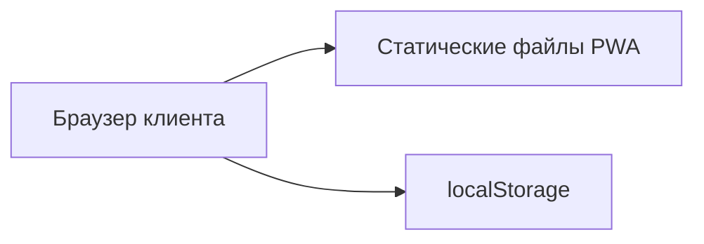
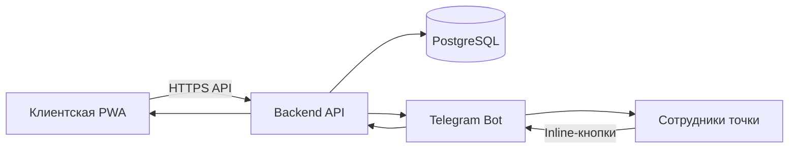
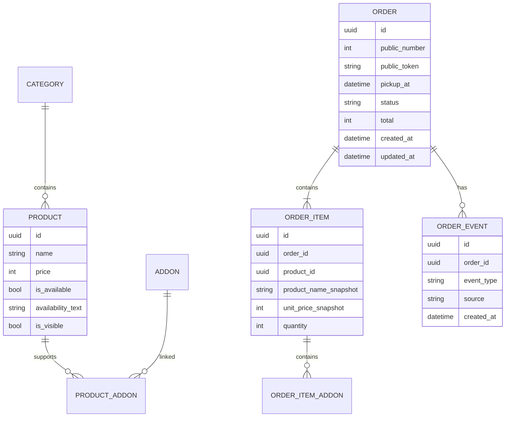

# Архитектура проекта

## Назначение

«Шаверма БН» — сервис анонимного предзаказа еды на самовывоз.

Основной путь:

```text
клиентская PWA → backend → база → Telegram → сотрудник
```

---

## Текущая версия

Сейчас PWA работает как статический клиент:



Работают меню, корзина, допы, время и локальный экран заказа.

Ограничения:

- заказ не отправляется на точку;
- нет общей нумерации;
- наличие и цены зашиты в коде;
- статусы не синхронизируются;
- слот не проверяется централизованно.

---

## Целевая архитектура MVP



### Клиентская PWA

Отвечает за:

- отображение меню;
- корзину;
- выбор времени;
- создание заказа;
- номер и статус;
- сохранение ссылки на последний заказ.

Не хранит секреты и не принимает окончательных бизнес-решений.

### Backend API

Центральный источник истины:

- меню и наличие;
- слоты;
- создание заказа;
- расчёт суммы;
- уникальный номер;
- публичный токен;
- смена статуса;
- Telegram-уведомления;
- защита от дублей;
- дальнейшая интеграция с оплатой.

### PostgreSQL

Хранит:

- категории;
- товары;
- допы;
- доступность;
- настройки точки;
- заказы;
- позиции заказов;
- статусы;
- журнал действий.

Персональные данные клиентов не хранятся.

### Telegram-бот

Используется как операционная панель:

- новые заказы;
- «Принять»;
- «Обработан»;
- аварийная отмена;
- стоп-лист;
- пауза заказов;
- настройки слотов.

---

## Базовая модель данных



Цена и название товара копируются в заказ, чтобы старый заказ не менялся после обновления меню.

---

## Статусы

Основной флоу:

```text
created → accepted → processed
```

Аварийный:

```text
cancelled
```

Где:

- `created` — заказ создан сервером;
- `accepted` — сотрудник принял заказ;
- `processed` — заказ обработан и готов к получению;
- `cancelled` — заказ отменён сотрудником.

Статуса `issued` нет.

---

## Идентификаторы

У заказа три идентификатора:

- UUID для базы;
- короткий номер для выдачи;
- случайный токен для страницы заказа.

Номер нельзя использовать как единственный ключ доступа.

---

## Обновление статуса

Для MVP достаточно polling:

```text
GET /api/orders/{token}
```

Раз в 10–15 секунд.

WebSocket или SSE добавляются только при реальной необходимости.

---

## Предлагаемый стек

### Frontend

- текущий HTML/CSS/JavaScript;
- переход на фреймворк только при росте сложности.

### Backend

- Node.js + Fastify/NestJS;
- либо Python + FastAPI.

### Infrastructure

- небольшой VDS;
- PostgreSQL;
- Docker Compose;
- Nginx или Caddy;
- HTTPS;
- резервное копирование базы.

---

## Безопасность

Минимум:

- HTTPS;
- секреты только в environment variables;
- серверная проверка цены, наличия и слота;
- idempotency key при оформлении;
- rate limiting;
- Telegram-доступ только для разрешённой группы;
- ротация или анонимизация access-логов;
- резервные копии базы.
