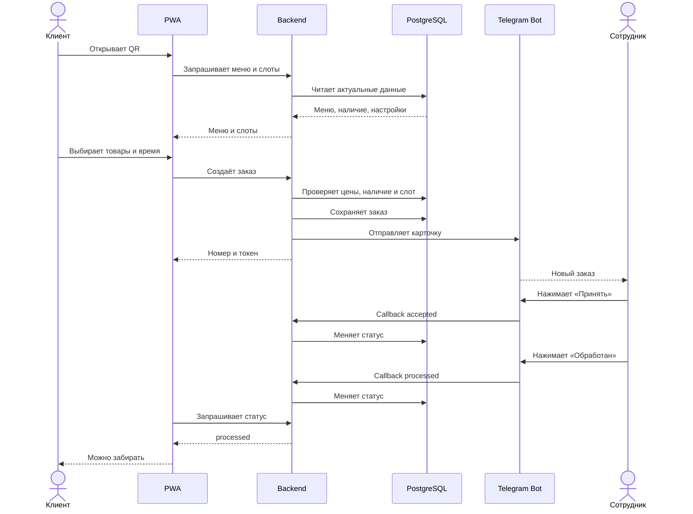

# Флоу заказа

## Полный сценарий



---

## Создание заказа

Backend должен:

1. принять корзину и слот;
2. загрузить товары из базы;
3. проверить товары и допы;
4. пересчитать сумму;
5. проверить доступность слота;
6. создать заказ одной транзакцией;
7. присвоить номер и токен;
8. отправить Telegram-карточку;
9. вернуть клиенту номер и ссылку.

---

## Telegram-карточка

```text
Новый заказ №137
Получение: 18:30

2 × Классика в лаваше
  + халапеньо
  + грибы

1 × Картофель фри

Итого: 790 ₽
Оплата при получении
```

Сначала:

```text
[Принять] [Отменить]
```

После принятия:

```text
[Обработан] [Отменить]
```

Карточка редактируется, а не дублируется.

---

## Наличие

Сотрудник меняет позицию через Telegram:

```text
[В наличии] [Стоп] [Будет позже] [Скрыть]
```

Изменения сразу влияют на новые заказы.

---

## Пауза заказов

```text
[Приостановить заказы]
[Возобновить заказы]
```

Во время паузы меню доступно, оформление заблокировано.

---

## Слоты

Начальная модель:

- шаг 15 минут;
- минимальное время приготовления;
- лимит заказов;
- скрытие заполненных слотов;
- повторная проверка слота на сервере.

---

## Ошибочные сценарии

### Повторное оформление

Frontend отправляет idempotency key. Backend возвращает уже созданный заказ.

### Товар закончился

Backend отклоняет заказ и сообщает недоступную позицию.

### Слот заполнился

Клиенту предлагается выбрать другое время.

### Telegram недоступен

Заказ остаётся в базе, отправка уведомления повторяется.

### Повторный callback

Не создаёт дополнительное событие и не меняет статус повторно.
