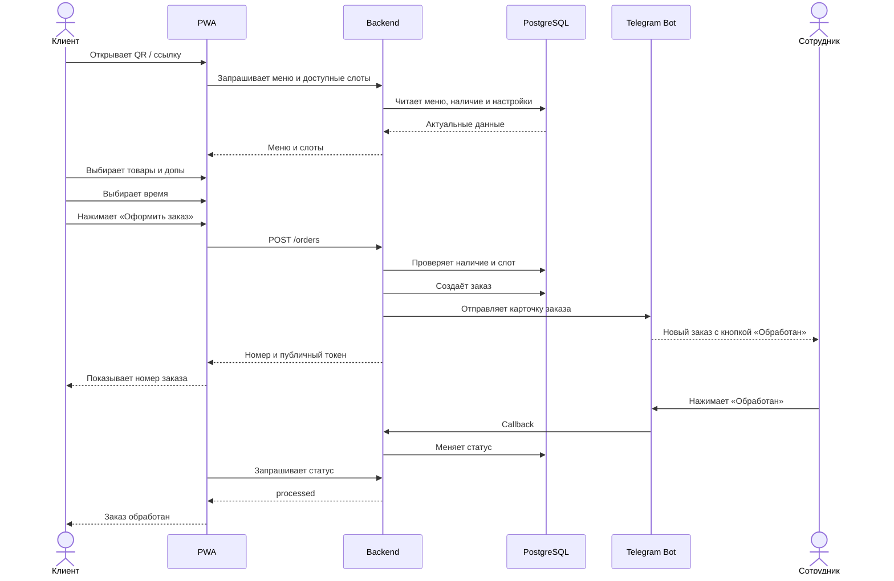

# Флоу заказа

## 1. Клиентский сценарий



---

## 2. Экран оформления

Клиент видит:

- состав корзины;
- количество;
- допы;
- итоговую сумму;
- доступные временные слоты;
- предупреждение об оплате при получении.

Клиент не вводит персональные данные.

---

## 3. Создание заказа

При создании заказа backend должен:

1. принять список позиций и выбранный слот;
2. загрузить актуальные товары из базы;
3. проверить доступность каждой позиции;
4. проверить доступность каждого допа;
5. пересчитать цены;
6. проверить лимит слота;
7. создать заказ и позиции одной транзакцией;
8. присвоить публичный номер;
9. создать публичный токен;
10. отправить Telegram-уведомление;
11. вернуть клиенту номер и ссылку заказа.

---

## 4. Telegram-карточка

Пример:

```text
Новый заказ №137

Получение: 18:30

2 × Классика в лаваше
  + халапеньо
  + грибы

1 × Картофель фри

Итого: 790 ₽
Оплата при получении
```

Кнопки:

```text
[Обработан]
[Отменить]
```

После нажатия карточка редактируется, а не создаётся заново.

---

## 5. Статусы

### accepted

Заказ создан и принят системой.

Клиент видит:

```text
Заказ принят
```

### processed

Сотрудник завершил обработку заказа.

Клиент видит:

```text
Заказ обработан — можно забирать
```

### cancelled

Заказ отменён сотрудником в аварийной ситуации.

Клиент видит:

```text
Заказ не удалось выполнить.
Пожалуйста, оформите новый заказ или обратитесь на точку.
```

---

## 6. Стоп-лист

Сотрудник управляет доступностью через Telegram.

Пример:

```text
Наличие → Шаверма → Моцарелла в лаваше
```

Доступные действия:

```text
[В наличии]
[Стоп]
[Будет позже]
[Скрыть]
```

Для «Будет позже»:

```text
[Через 30 минут]
[Через час]
[Указать время]
```

Изменение должно сразу влиять на новые заказы.

---

## 7. Остановка заказов

В Telegram должна быть глобальная команда:

```text
[Приостановить заказы]
[Возобновить заказы]
```

При остановке:

- меню остаётся доступным;
- корзину можно просматривать;
- оформить новый заказ нельзя;
- клиент видит понятное сообщение.

---

## 8. Временные слоты

Начальная модель:

- шаг — 15 минут;
- минимальное время приготовления — 15–30 минут;
- лимит — фиксированное количество заказов на слот;
- закрытые и заполненные слоты не показываются.

Пример:

```text
18:30
18:45
19:00
19:15
```

Сервер повторно проверяет слот при оформлении.

---

## 9. Работа без персональных данных

В заказе хранятся:

- внутренний ID;
- публичный номер;
- публичный токен;
- состав;
- цены;
- время получения;
- статус;
- технические timestamps.

Не хранятся:

- имя;
- телефон;
- email;
- адрес;
- профиль клиента;
- история покупок конкретного человека.

---

## 10. Ошибочные сценарии

### Повторное нажатие «Оформить»

Frontend передаёт idempotency key.

Backend возвращает уже созданный заказ вместо создания нового.

### Товар закончился

Backend отклоняет создание и сообщает, какая позиция недоступна.

### Слот заполнился

Backend предлагает клиенту обновить список времени.

### Telegram временно недоступен

Заказ сохраняется в базе.

Backend повторяет отправку уведомления. Ошибка Telegram не должна уничтожать заказ.

### Сотрудник нажал кнопку дважды

Повторный callback не создаёт второе событие и не ломает статус.
